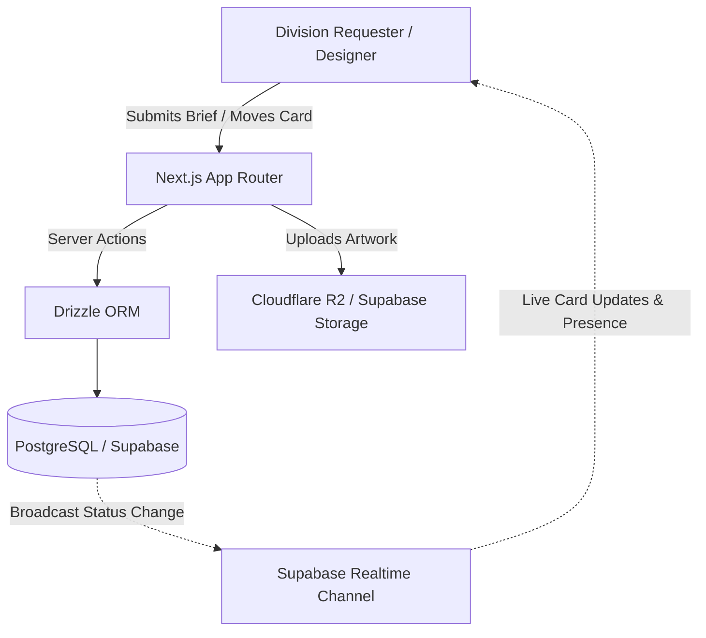

export const metadata = {
  title: "Center of Publication Media",
  slug: "copm",
  description:
    "A collaborative Kanban publication & design workflow management system for IEEE SB IPB University featuring multi-workspace divisions and realtime collaboration.",
  stack: ["nextjs", "ts", "supabase", "postgres"],
  year: "2026",
  category: "Full Stack Application",
  accent: "#2563eb",
  thumbnail: "/projects/copm/copm.mp4",
  github: "https://github.com/gimigkk/Center-of-Publication-Media",
  links: [
    {
      url: "https://github.com/gimigkk/Center-of-Publication-Media",
      label: "Source Code",
      icon: "github",
    },
  ],
};

<Trans lang="en">

## The Context & Friction
Student organization media divisions constantly battle chaotic design requests. Google Forms, scattered WhatsApp chats, and untracked Google Drive folders create endless friction:
- Design briefs get lost or missing essential specifications.
- Designers duplicate work or sit idle waiting for unclear revisions.
- Leadership lacks pipeline visibility across simultaneous division initiatives.

As the developer building for **IEEE Student Branch IPB University**, I designed and engineered **Center of Publication Media (COPM)**—a dedicated Kanban-style publication operations system that streamlines requests from brief submission to final deliverable archival.

---

## Core Capabilities

### 1. Interactive Multi-Workspace Kanban Pipeline
- **Stage Progression**: 4 distinct workflow stages (*Pending*, *In Progress*, *Review*, and *Completed*) powered by `@dnd-kit`.
- **Division Scoping**: Independent workspace board views partitioned cleanly across IEEE divisions.
- **Archive Drop Zone**: Drag completed job cards directly into the archive table for structured long-term tracking.

### 2. Standardized Brief Intake
- Built structured request submission forms with automatic Google Docs brief link validation.
- Prevents unformatted or incomplete design tickets before they ever enter the pipeline.

### 3. Deliverables Management & Artwork Gallery
- Modal preview gallery enabling stakeholders to inspect high-res PNG, JPG, and multi-page PDF deliverables.
- Direct artwork download actions with R2/storage bucket signed URL dispatch.

### 4. Real-time Presence & Notifications
- Live collaborator presence indicators powered by Supabase Realtime Channels.
- In-app notification center dispatching instant updates for design assignments, revisions, and status shifts.

</Trans>

<Trans lang="id">

## Konteks & Kendala
Divisi media dan publikasi organisasi mahasiswa kerap kewalahan mengelola request desain yang berantakan. Kombinasi Google Forms, chat WhatsApp yang tenggelam, dan folder Google Drive tanpa struktur memicu masalah klasik:
- Brief desain tercecer atau tidak memiliki spesifikasi jelas.
- Desainer mengerjakan tugas ganda atau tertahan revisi tanpa status transparan.
- Pimpinan divisi kesulitan memantau progress publikasi lintas departemen.

Sebagai developer untuk **IEEE Student Branch IPB University**, saya merancang dan membangun **Center of Publication Media (COPM)**—platform manajemen alur kerja publikasi berbasis Kanban dari intake brief hingga arsip karya final.

---

## Fitur Utama

### 1. Kanban Pipeline & Multi-Workspace
- **Alur 4 Tahap**: Board interaktif (*Pending*, *In Progress*, *Review*, *Completed*) berbasis `@dnd-kit`.
- **Workspace per Divisi**: Pengelompokan board mandiri sesuai divisi operasional IEEE.
- **Archive Drop Zone**: Drag-and-drop kartu pekerjaan langsung ke tabel arsip untuk rekapitulasi data rapi.

### 2. Formulir Brief Terstandar
- Modal submission dengan validasi otomatis tautan brief Google Docs.
- Memastikan desainer hanya menerima brief yang lengkap sebelum pekerjaan dimulai.

### 3. Galeri Deliverables & Unduhan Karya
- Modal inspeksi karya resolusi tinggi untuk format PNG, JPG, dan PDF multi-halaman.
- Akses unduh cepat terintegrasi presigned storage URL.

### 4. Kolaborasi Realtime & Notifikasi
- Indikator kehadiran aktif kolaborator via Supabase Realtime Channels.
- Pusat notifikasi in-app untuk penugasan desainer, request revisi, dan perubahan status.

</Trans>

## Architecture & Data Flow

<Trans lang="en">

## Technical Decisions

- **Full-Stack Next.js App Router**: Utilized Server Actions for database mutations, ensuring zero-waterfall operations and direct form validation with Zod.
- **Type-Safe Persistence**: Drizzle ORM paired with PostgreSQL for clean migrations and relational queries across workspaces and deliverables.
- **Low-Latency Realtime Sync**: Custom React hooks (`useRealtimeBoard`, `usePresence`) hooked into Supabase websocket channels to reflect board changes instantaneously.

</Trans>

<Trans lang="id">

## Keputusan Teknis

- **Next.js App Router Full-Stack**: Mengandalkan Server Actions untuk mutasi database dengan validasi skema Zod ketat tanpa boilerplate API route berlebih.
- **Type-Safe ORM**: Drizzle ORM bersama PostgreSQL menjamin integritas relasi antar workspace, kartu pekerjaan, dan lampiran file.
- **Sinkronisasi Realtime**: Hook kustom (`useRealtimeBoard`, `usePresence`) via websocket Supabase agar perpindahan card terupdate instan ke seluruh anggota aktif.

</Trans>
