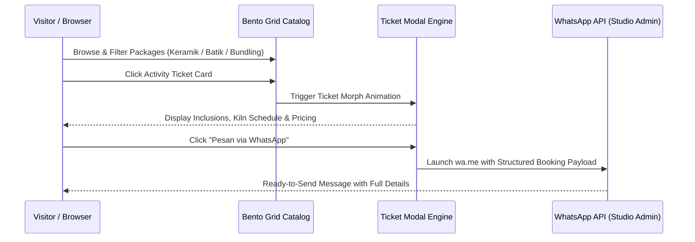

export const metadata = {
  title: "Imah Keramik Bogor",
  slug: "imah-keramik-bogor",
  description:
    "An interactive digital showcase and catalog concept for an educational ceramic studio in Bogor, featuring adaptive bento layouts and structured WhatsApp booking.",
  stack: ["react", "ts", "vite", "tailwind", "playwright"],
  year: "2026",
  category: "Web Development",
  accent: "#226639",
  thumbnail: "/projects/imah-keramik-bogor/imah-keramik.mp4",
  github: "https://github.com/gimigkk/Imah-Keramik-Bogor",
  links: [
    { url: "https://imah-keramik-bogor.vercel.app/", label: "Live Concept", icon: "globe" },
    { url: "https://github.com/gimigkk/Imah-Keramik-Bogor", label: "Source Code", icon: "github" }
  ],
  weight: 5,
};

<Trans lang="en">

## The Problem

**Imah Keramik Bogor** is an educational ceramic studio and cultural tourism venue in Bogor, Indonesia. Despite offering rich hands-on experiences—from Ceramic Art Classes (CAC) and wood batik painting to private kiln firings and hall rentals—all operational details were scattered across Instagram posts, highlights, and static brochure photos.

This fragmented presence created significant friction for potential visitors:
- **Scattered Information**: Visitors had to dig through social media posts to piece together pricing, facility rules, and class prerequisites.
- **Buried Product Nuances**: Crucial inclusions (e.g., 2x kiln firings, glaze selections, firing durations, group minimums) were hidden in image captions or lost in direct messages.
- **Manual Booking Overhead**: Inquiries relied on open-ended DMs or generic forms, forcing studio staff into repetitive back-and-forth messaging just to gather basic booking details.

## The Solution

I designed and engineered an interactive single-page digital hub and web catalog for Imah Keramik Bogor, transforming static brochures into a tactile, high-conversion web experience.

```text
Instagram Brochure Captions      Digital Web Platform               UX Outcome
---------------------------      --------------------               ----------
Scattered Info Posts      --->   Persistent Overview Banner   --->  Instant pricing clarity
Complex Workshop Menus    --->   Adaptive Bento Grid System   --->  Clear tier comparison
Manual DM Inquiries       --->   WhatsApp Booking Engine      --->  Zero-friction checkout
```

## Key Features & UX Decisions

### 1. Adaptive Bento Grid Catalog
Rather than presenting a monolithic list, the catalog organizes activities into an intuitive Bento Grid:
- **Persistent General Access**: The top grid permanently anchors entrance rules, general workshops, business packages, and hall rentals so venue policies remain visible across all tabs.
- **Categorized Tabs**: Filter seamlessly between *Keramik*, *Membatik Kayu*, and *Bundling*.
- **Visual Hierarchy & UX Badges**: Flagship experiences like the *Ceramic Art Class* occupy a prominent 2×2 hero card, while clear badges (`Favorit`, `Hemat`, `Kustom`, `Expert`) highlight key decision factors instantly.

### 2. Direct WhatsApp Booking Integration
Instead of passive text or detached inquiry forms, selecting any activity card triggers a dynamic modal (`TicketModal.tsx`). The engine formats an exact, structured WhatsApp message containing the selected package title, pricing tier, and confirmed inclusions—allowing visitors to send a complete booking request with a single tap.

### 3. Tactile Physical Metaphor
To echo the tactile nature of clay and pottery, the UI incorporates physical ticket aesthetics:
- **Perforation Masks**: Custom CSS and SVG perforation masks simulate torn physical admission stubs.
- **Ticket Morph Engine**: Fluid grid-to-modal transition animations maintain spatial continuity when inspecting package details.
- **Parallax Tile Background**: A lightweight procedural SVG tile pattern adds organic depth without causing layout shifts.

</Trans>

<Trans lang="id">

## Masalahnya

**Imah Keramik Bogor** adalah studio edukasi keramik dan destinasi wisata budaya di Bogor. Meskipun memiliki beragam aktivitas menarik—mulai dari Ceramic Art Class (CAC), membatik kayu, hingga sewa aula dan pembakaran kiln—seluruh informasinya tersebar di postingan Instagram, story highlight, dan foto brosur statis.

Hal ini menimbulkan kendala bagi calon pengunjung:
- **Informasi Tersebar**: Pengunjung harus menelusuri banyak postingan media sosial untuk mengetahui harga tiket masuk, paket kelas, dan aturan fasilitas.
- **Detail Penting Tersembunyi**: Informasi krusial seperti proses 2x pembakaran kiln, opsi pewarnaan glasur, dan kuota rombongan sering kali terlewat.
- **Proses Reservasi Manual**: Pemesanan masih bergantung pada DM Instagram manual tanpa format pesan terstruktur, memicu tanya-jawab yang berulang-ulang.

## Solusinya

Saya merancang dan membangun platform web interaktif satu halaman untuk Imah Keramik Bogor, mengubah materi promosi statis menjadi pengalaman katalog digital yang informatif dan mudah digunakan.

## Fitur Utama & Keputusan Desain

### 1. Katalog Bento Grid Adaptif
Katalog disusun menggunakan tata letak Bento Grid yang dinamis:
- **Informasi Umum Terpadu**: Bagian atas menampilkan HTM, paket usaha, dan sewa aula secara permanen agar aturan dasar selalu terlihat.
- **Kategori Aktivitas Terfokus**: Navigasi tab memisahkan kelas *Keramik*, *Membatik Kayu*, dan *Paket Bundling*.
- **Hierarki & Badge UX**: Paket utama seperti *Ceramic Art Class* tampil menonjol dengan kartu 2×2, dilengkapi badge penegas (`Favorit`, `Hemat`, `Kustom`, `Expert`) untuk memudahkan keputusan pengunjung.

### 2. Integrasi Pemesanan WhatsApp Terstruktur
Memilih kartu aktivitas akan membuka modal detail tiket yang secara otomatis menyusun pesan WhatsApp siap kirim lengkap dengan nama paket, rincian fasilitas, dan harga. Pengunjung dapat langsung melanjutkan reservasi ke admin studio dalam satu klik.

### 3. Sentuhan Visual Tiket Fisik
Menyesuaikan karakter studio keramik yang mengutamakan karya fisik:
- **Masking Perforasi Tiket**: Desain kartu mengadopsi perforasi tiket sobek untuk memberikan kesan tiket workshop nyata.
- **Animasi Transisi Tiket**: Transisi halus dari kartu grid ke modal detail menjaga kontinuitas interaksi pengguna.
- **Latar Pola Keramik Bergerak**: Pola ubin SVG ringan dengan efek paralaks memberikan kedalaman visual yang selaras dengan tema kerajinan tanah liat.

</Trans>



<Trans lang="en">

## Tech Stack & Architecture

- **Core & Runtime**: React 19, TypeScript, Vite
- **Styling**: Tailwind CSS v4, Vanilla CSS Masks
- **Testing & Verification**: Playwright E2E suite validating ticket interactions, modal focus traps, and responsive viewport fidelity.

</Trans>

<Trans lang="id">

## Teknologi & Arsitektur

- **Frontend**: React 19, TypeScript, Vite
- **Styling**: Tailwind CSS v4, Masking CSS kustom
- **Pengujian**: Playwright E2E untuk memastikan alur tiket, modal, dan tampilan responsif berjalan lancar.

</Trans>
