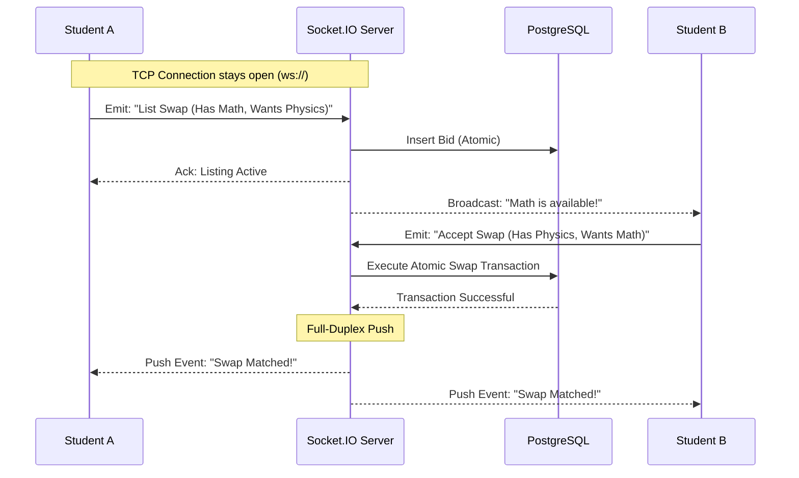

export const metadata = {
  title: "KRSwitch",
  slug: "krswitch",
  description:
    "A real-time schedule exchange platform that auto-matches university students looking to swap class sections seamlessly.",
  stack: ["react", "express", "ts", "prisma", "postgres", "socket.io"],
  year: "2026",
  category: "Full-Stack Platform",
  accent: "#10b981",
  thumbnail: "/projects/krswitch/KRSwitch.mp4",
  github: "https://github.com/DeatWalls-Azka/KRSwitch-frontend",
  links: [
    { url: "https://github.com/DeatWalls-Azka/KRSwitch-frontend", label: "Frontend", icon: "github" },
    { url: "https://github.com/gimigkk/KRSwitch-backend", label: "Backend", icon: "github" }
  ],
  weight: 1,
};

<Trans lang="en">

## The Problem
Getting stuck with a terrible class schedule is the worst. Students were trying to swap classes manually in massive WhatsApp groups, which was chaotic, slow, and mostly based on luck. People were constantly getting sniped or losing track of who wanted what.

## The Solution
I built **KRSwitch**, a platform that acts like a stock exchange for college schedules.

Students just log in, pick the class they have, and pick the class they actually want. Instead of hunting for a trading partner, the system does it for them. The moment two students want each other's schedules, it instantly locks the match and executes the swap.

## How the WebSocket Engine Works
Because class availability changes by the millisecond during registration, I had to make sure the data was always live. I built a real-time event system using Socket.IO so users see availability updates the exact moment they happen.

</Trans>

<Trans lang="id">

## Masalahnya
Dapet jadwal kuliah yang jelek itu emang paling nyebelin. Mahasiswa biasanya nyoba tukeran kelas manual lewat grup angkatan di WhatsApp, yang pastinya kacau, lambat, dan hoki-hokian. Sering banget udah nemu yang pas tapi keduluan orang, atau pusing sendiri nyari siapa yang mau nuker.

## Solusinya
Kita ngebangun **KRSwitch**, platform yang cara kerjanya mirip bursa saham tapi buat jadwal kuliah.

Mahasiswa tinggal login, pilih kelas yang mereka dapet, dan pilih kelas yang sebenernya mereka mau. Daripada ribet nyari partner tukeran, sistem yang bakal nyariin. Begitu ada dua mahasiswa yang jadwalnya saling cocok, sistem langsung ngunci *match*-nya dan ngeksekusi penukarannya secara otomatis.

## Cara Kerja Mesin WebSocket
Karena slot kelas bisa berubah dalam hitungan milidetik pas masa KRS, kita harus mastiin datanya bener-bener *live*. Kita bikin sistem event real-time pake Socket.IO biar pengguna bisa liat update ketersediaan tepat di detik kejadiannya.

</Trans>

<Trans lang="en">

## Why I Built It This Way
I needed the platform to handle high concurrency without breaking a sweat. 

For the backend, the matchmaking had to be bulletproof. I wrapped the swapping logic in PostgreSQL atomic transactions. This guarantees that if two people try to claim the last spot at the exact same millisecond, only one goes through. Zero chance of double-booking.

For the frontend, I skipped the flashy animations. The light mode looks like Microsoft Excel because it needed extreme data density, and the dark mode looks like a crypto trading terminal for late-night schedule sniping.

Other technical details:
- **State Batching**: The React frontend is heavily optimized so that live Socket.IO events don't cause the UI to stutter.
- **Prisma ORM**: The database schema was pretty complex, so Prisma kept the backend readable and strongly typed.
- **Admin Dashboard**: I added an operator view so university staff can monitor the swaps and manually override things if something goes wrong.

</Trans>

<Trans lang="id">

## Kenapa Dibangun Kayak Gini
Kita butuh platform yang bisa nanganin *traffic* super tinggi tanpa nge-lag sedikitpun.

Untuk backend, sistem *matchmaking*-nya harus kebal dari error. Kita ngebungkus logika tukerannya pake transaksi atomik di PostgreSQL. Ini ngejamin kalo misalnya ada dua orang yang rebutan sisa satu slot di milidetik yang sama persis, cuma satu yang bakal masuk. Nol kemungkinan *double-booking*.

Untuk frontend, kita skip animasi-animasi lebay. *Light mode*-nya keliatan kayak Microsoft Excel karena butuh kepadatan data yang ekstrem, dan *dark mode*-nya dibikin mirip terminal *trading crypto* buat sensasi *sniping* jadwal tengah malem.

Detail teknis lainnya:
- **State Batching**: Frontend React kita optimasi habis-habisan biar event Socket.IO yang masuk bertubi-tubi gak bikin UI-nya patah-patah.
- **Prisma ORM**: Skema database-nya lumayan ribet, jadi Prisma ngebantu banget ngejaga backend tetep rapi dan *strongly typed*.
- **Dashboard Admin**: Kita nambahin tampilan buat operator biar staf kampus bisa mantau proses tukeran dan ngelakuin *override* manual kalo ada yang error.

</Trans>
