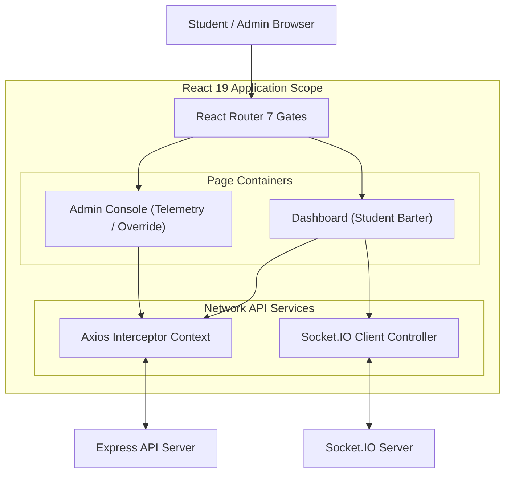

export const metadata = {
  title: "KRSwitch",
  slug: "krswitch",
  description:
    "A real-time schedule exchange platform that auto-matches university students looking to swap class sections seamlessly.",
  stack: ["react", "express", "ts", "prisma", "postgres", "socket.io"],
  year: "2026",
  category: "Full-Stack Platform",
  accent: "#10b981",
  thumbnail: "/projects/krswitch/thumbnail.png",
};

# Revolutionizing University Scheduling

## The Problem: Schedule Gridlock
University students often get stuck with inconvenient class schedules that clash with their preferences — overlapping sections, bad time slots, or unwanted lecturers. Finding someone to swap with manually is tedious, prone to errors, and highly disorganized. It’s a frustrating bottleneck that wastes time and causes unnecessary stress at the start of every semester.

## The Solution: Seamless Auto-Matching
**KRSwitch** is a smart trading floor that automatically matches students who want to swap class sections. Instead of scrolling through endless group chats to find a trade partner, students simply list the class they have and the class they want. 

The platform handles the entire negotiation process instantly. Once a mutual match is found, the swap is locked in automatically, ensuring both parties get the timetable they actually want without any friction.

## Impact & Value
- **Zero Friction:** Completely eliminates the need for manual scheduling negotiations.
- **Fairness Guarantee:** Swaps are atomic and instant, preventing double-booking or stolen slots.
- **Administrative Relief:** A powerful operator view allows university staff to monitor live telemetry, manage the student registry, and perform manual overrides effortlessly.

---

# Under the Hood: Technical Deep Dive

While the user experience is designed to be simple, the engine powering KRSwitch handles thousands of concurrent users executing highly sensitive transactions in real-time.

## Architecture Overview

KRSwitch is composed of a decoupled frontend and backend that communicate via standard REST APIs and WebSockets.

## Real-Time WebSocket Architecture

At the core of KRSwitch is a real-time event engine powered by **Socket.IO**. Since schedule availability changes by the millisecond during peak enrollment periods, relying on traditional HTTP polling would have been too slow and resource-intensive. 

To solve this, the application implements a robust bidirectional communication layer:
- **Centralized Global Context:** Instead of redundant socket instances scattered across components, the frontend utilizes a unified `SocketContext`. The connection is established once upon authentication, binding the active session to the socket ID and preventing duplicate connections.
- **Bi-Directional Broadcasting:** When a student proposes a class swap on the "trading floor", the client emits a mutation event. The server validates the trade atomically in the database and broadcasts the updated state (`trade_updated`, `schedule_locked`) to all connected peers.
- **Admin Telemetry:** Management dashboards listen to the global socket stream, allowing administrators to monitor the pulse of the exchange in real-time, observing active swaps, connections, and system load without manual refreshes.
- **Production Resilience:** The socket clients utilize relative path routing for seamless fallback and automatic reconnection strategies with exponential backoff, ensuring uninterrupted service even under shaky network conditions.

## Backend Robustness & Security
- **Atomic Matchmaking:** Schedule swaps run in isolated PostgreSQL transaction blocks to guarantee consistency and prevent double-claiming.
- **Conflict Guards:** Intelligent schedule conflict detection prevents overlapping classes before confirming swaps.
- **Secure Authentication:** Hardened Google OAuth 2.0 PKCE flow with strict SameSite JWT cookie management.

## Client Performance Optimizations

To maintain a fluid 60fps rendering during highly concurrent schedule exchanges, the frontend implements several advanced optimizations:
- **State Batching**: WebSocket state modifications update multiple states in a single render cycle, avoiding layout thrashing.
- **useMemo Filter Guards**: Complex class timetables and student directories are memoized to avoid expensive sorting operations on the fly.
- **Linear Tooltip Interpolation (LERP)**: Tooltips and schedule graph overlays use linear interpolation coordinates to track mouse movements rather than sudden pixel changes.

## Testing & Reliability

Built for reliability under high concurrency:
- Tested with **Cypress** for end-to-end frontend flows.
- Backend validated using **Vitest** and a custom CLI load simulator to handle staggered concurrent transactions with sub-millisecond latencies.

## Design Inspiration
The UI was built with a highly utilitarian focus. The light mode design draws heavily from the classic green and white aesthetic of Microsoft Excel, prioritizing data density and clarity. Conversely, the dark mode is directly inspired by Stockbit, providing a sleek, high-contrast environment suited for monitoring real-time barter feeds.

## Embracing Prisma ORM
This project marked my first time using an Object-Relational Mapper (ORM), and I absolutely loved it. The `schema.prisma` file is incredibly simple and elegant. It turns complex database relationships into clean, readable declarative code, making the mental model of the entire Postgres database an absolute joy to work with.
