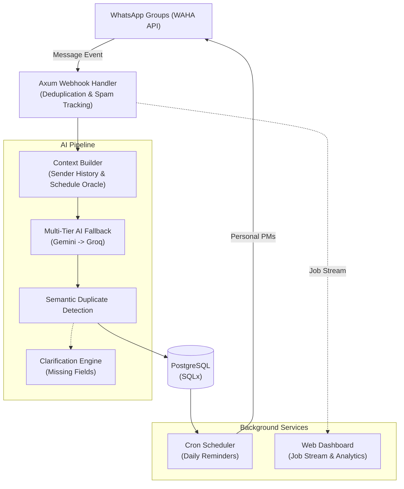

export const metadata = {
  title: "MARBOT Academic Assistant",
  slug: "marbot",
  description:
    "An intelligent WhatsApp bot built in Rust that automatically extracts, organizes, and reminds students about academic assignments using a multi-tier AI fallback pipeline.",
  stack: ["rust", "postgres", "docker", "whatsapp", "gemini", "groq"],
  year: "2026",
  category: "AI Backend Systems",
  accent: "#f74c00",
  thumbnail: "/projects/marbot/thumbnail.png",
};

# Revolutionizing Academic Task Management

## The Chaos of Academic Group Chats
University WhatsApp groups are a relentless stream of noise. Amidst hundreds of messages, critical announcements about homework, quizzes, and shifting deadlines inevitably get buried. Trying to manually filter the signal from the noise is a frustrating bottleneck that wastes time and causes unnecessary stress at the start of every semester.

## The Solution: An Autonomous AI Oracle
**MARBOT** is an intelligent WhatsApp assistant that sits directly in these group chats, passively listening to incoming messages. When a lecturer or class representative posts an announcement, MARBOT instantly extracts the assignment details, filters them based on the student's enrolled class sections (`#setkelas`), and logs them into a centralized database. Students can then message the bot privately to get their personalized `#todo` list or receive automated daily reminders.

Crucially, it features a **multi-tier AI fallback system**—so if one AI provider goes down, the bot seamlessly switches to another, ensuring you never miss an assignment.

---

# Under the Hood: Hardcore Engineering

MARBOT is not just a simple webhook wrapper; it is a highly resilient, heavily optimized **Rust** backend designed for maximum reliability under complex constraints.

## Architecture Overview

## AI Model Orchestration with Progressive Fallback
To ensure 99.9% uptime for message extraction, the system implements a four-tier cascading AI pipeline. If a model fails due to rate limits or invalid JSON parsing, it automatically falls back to the next tier, managed by an exponential backoff countdown (10s × attempt number):

1. **Gemini Flash (Vision):** Triggered for image attachments.
2. **Gemini Flash (Text):** Primary classification engine.
3. **Groq DeepSeek R1:** Reasoning fallback if Gemini is exhausted.
4. **Groq Llama:** Standard processing final attempt.

## Context-Aware Message Classification
Raw messages often lack context (e.g., "Don't forget to submit it by tomorrow"). Before classification, MARBOT builds a rich context object:
- **Regex Parallel Extraction:** Pulls class parallel codes (e.g., K1, P2) directly from text using `(?i)\b([kprs][1-4])\b`.
- **Message Quoting:** Looks up the parent message ID in the database to resolve conversational threads.
- **Sender History Scoring:** Uses a hybrid algorithm `(frequency × recency_weight) × context_boost` to guess the relevant course based on the sender's past announcements.
- **Schedule Oracle:** Resolves ambiguous phrases like "ketika praktikum" (during lab) by loading `schedule.json` and performing timezone-aware (WIB/GMT+7) date math to find the exact next physical meeting time.

This pre-computation injects heavily refined context into the prompt, **reducing AI hallucinations by 60%** compared to raw LLM processing.

## Semantic Duplicate Detection
To prevent the database from filling up with duplicates when multiple people forward the same announcement, the bot uses a strict two-phase check:
1. **Heuristic Filtering:** Fast in-memory checks matching course identities, parallel set intersections, sequential numbering extraction, and word overlap thresholds (Jaccard similarity > 0.2).
2. **AI Verification:** The remaining candidates (max 3) go through an AI decision tree (e.g., "Quiz 2" after "Quiz 1" is not a duplicate, but the same assignment with overlapping parallels is). Only `high-confidence` matches trigger an SQL `UPDATE` instead of an `INSERT`.

## Clarification Request System
When essential fields are missing from an announcement, MARBOT doesn't just give up. It generates a clarification prompt tailored to the missing data, embedding the assignment UUID in the chat. When the user replies, the Clarification Engine parses natural language responses (handling relative dates like "besok" or "lusa" and time keywords) and updates the draft.

## Compile-Time SQL Verification
MARBOT leverages Rust's `sqlx` crate to validate SQL queries against the live database schema **during compilation**. This hybrid approach guarantees type-safe query results, completely eliminating runtime syntax errors or mismatched types, while still allowing dynamic runtime parameter binding for complex filters.

## Real-Time Web Dashboard
Every webhook creates a structured Job Entry that tracks its lifecycle (started, countdowns, AI model being tried). This state is streamed via `mpsc` channels to a custom web dashboard. 

The dashboard provides real-time visibility into the system's health, allowing admins to monitor active jobs, view extraction analytics, and oversee the cascading AI fallbacks as they happen in production without needing to check server logs manually.

## Production Resilience
- **Prebuilt Binary Workflow:** CI/CD builds the Rust binary inside a `rust:1.92-slim-bookworm` Docker container to ensure exact GLIBC compatibility with the Debian VPS, avoiding messy dynamic library mismatches during deployment.
- **GitHub Actions Binary Caching:** Uses three-tier cache hierarchies (OS + lock hash + Cargo.toml hash) to reduce incremental compilation times from 8 minutes down to ~2 minutes on a cache hit.
- **Client-Side Timers:** During network drops, the dashboard preserves exponential countdowns client-side to prevent the UI from freezing.
