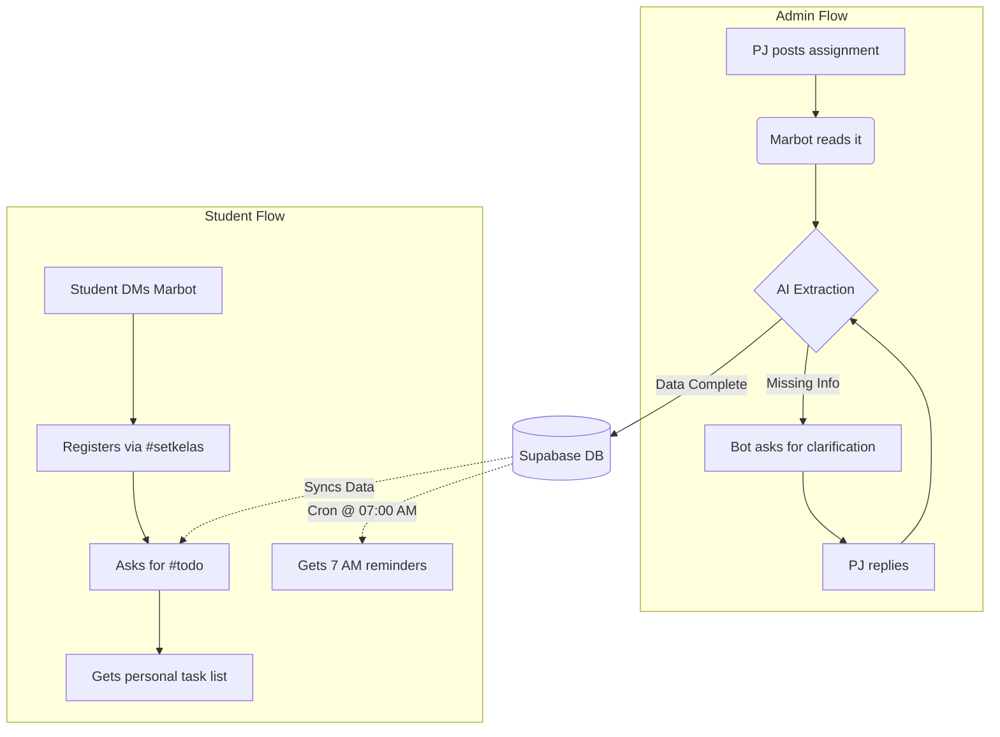

export const metadata = {
  title: "Marbot",
  slug: "marbot",
  description:
    "An intelligent WhatsApp assistant built in Rust that extracts, organizes, and reminds students about academic assignments using a resilient AI pipeline.",
  stack: ["rust", "whatsapp", "docker", "supabase"],
  year: "2026",
  category: "AI Backend Systems",
  accent: "#f74c00",
  thumbnail: "/projects/marbot/marbot.mp4",
  github: "https://github.com/gimigkk/marbot-academic-bot",
  weight: 0,
};

<Trans lang="en">

## The Problem
My university WhatsApp groups were a mess. Important stuff like assignments and deadlines would constantly get buried under hundreds of random chat messages. I was tired of scrolling for hours just to figure out what homework I had, and people were missing deadlines left and right.

## The Solution
I built **Marbot**, a WhatsApp bot that just sits in these groups and quietly listens. 

Whenever a PJ drops an assignment, Marbot catches it, figures out what it's about, checks which class it belongs to, and saves it to a Supabase database. Instead of digging through group chats, students just DM the bot to see their personal to-do list.

## Features & Commands
I wanted the bot to feel completely frictionless: no apps to download, just WhatsApp.

### For Students
- **`#setkelas [class_codes]`**: Tell the bot which classes you're taking (like `#setkelas K1 P2`). It'll only bother you with relevant assignments.
- **`#todo`**: Get a clean, sorted list of everything you need to do.
- **`#done [id]`**: Check off an assignment so it stops bugging you.
- **`#add` / `#edit` / `#delete`**: Manage tasks manually if the bot missed something or someone made a typo.
- **`#stats`**: Check your completion rate.
- **`#help`**: See all commands.

### Under the Hood
- **Passive Listening**: It reads the group chat naturally, you don't even need to tag it.
- **Morning Reminders**: Every day at 7:00 AM, it sends a quick summary of what's due soon.
- **Auto-Clarification**: If a PJ forgets to include a deadline, the bot literally replies to them in the group asking for it. When they answer, it updates the database.

</Trans>

<Trans lang="id">

## Masalahnya
Grup WhatsApp kampus kita berantakan banget. Info penting kayak tugas dan deadline sering ketimbun ratusan chat random. Kita capek harus scroll berjam-jam cuma buat nyari tau ada PR apa aja, dan banyak banget orang yang kelewatan deadline.

## Solusinya
Kita ngebangun **Marbot**, bot WhatsApp yang cuma diem aja di grup-grup angkatan sambil ngedengerin. 

Setiap kali ada PJ yang ngasih tugas, Marbot langsung nangkep, nyari tau ini tugas apaan, ngecek ini buat kelas mana, terus nyimpen ke database Supabase. Alih-alih ngorek-ngorek grup chat, mahasiswa tinggal nge-DM botnya buat ngeliat daftar tugas pribadi mereka.

## Fitur & Command
Kita pengen bot ini kerasa praktis banget: gak perlu download aplikasi, cukup lewat WhatsApp.

### Untuk Mahasiswa
- **`#setkelas [kode_kelas]`**: Ngasih tau bot kelas apa aja yang lo ambil (misal `#setkelas K1 P2`). Bot cuma bakal ngabarin tugas yang relevan sama kelas lo.
- **`#todo`**: Dapet daftar semua hal yang perlu lo kerjain dengan rapi dan terurut.
- **`#done [id]`**: Nyentang tugas biar botnya berhenti ngingetin lo.
- **`#add` / `#edit` / `#delete`**: Ngatur tugas manual kalo botnya kelewatan sesuatu atau ada yang salah ketik.
- **`#stats`**: Ngecek seberapa rajin lo ngerjain tugas.
- **`#help`**: Liat semua command.

### Di Balik Layar
- **Pasif Ngedengerin**: Dia baca grup chat secara natural, lo gak perlu nge-tag.
- **Reminder Pagi**: Setiap hari jam 7:00 pagi, dia ngirim rangkuman singkat tugas apa aja yang deadline-nya deket.
- **Auto-Klarifikasi**: Kalo ada PJ yang lupa ngasih deadline, botnya bakal bener-bener nge-reply di grup nanya deadline-nya kapan. Begitu dijawab, dia langsung update databasenya.

</Trans>

## How It Works

<Trans lang="en">

## Why I Built It This Way
I wrote the backend in Rust because I wanted it to be fast and not crash randomly. Since this handles everyone's homework, reliability was a big deal. 

The biggest challenge was the AI limits. Free AI APIs drop requests all the time, so I built a fallback system: if Gemini fails, it immediately tries Groq (DeepSeek/Llama). It literally won't stop until the assignment is safely in the database.

Other technical details:
- **Duplicate Checks**: People forward the same announcement multiple times. I added a filter to catch duplicates so the database doesn't get spammed.
- **SQLx in Rust**: This catches database query errors while compiling, which saved me from a lot of runtime crashes.
- **Live Dashboard**: I made a simple web dashboard using Rust's `mpsc` channels to watch the bot's logs in real-time and make sure the AI fallbacks are working.

</Trans>

<Trans lang="id">

## Kenapa Dibangun Kayak Gini
Kita nulis backend-nya pake Rust karena kita pengen ini kenceng dan gak gampang nge-crash. Karena ini ngurusin tugas sekampus, keandalan (reliability) itu penting banget. 

Tantangan terbesarnya ada di limit AI. API AI gratisan sering banget nge-drop request, jadi kita bikin sistem *fallback*: kalo Gemini gagal, dia bakal langsung nyoba Groq (DeepSeek/Llama). Dia bener-bener gak bakal berhenti sebelum tugasnya aman masuk database.

Detail teknis lainnya:
- **Cek Duplikat**: Orang-orang sering nge-forward pengumuman yang sama berkali-kali. Kita nambahin filter buat nangkep duplikat biar databasenya gak kena spam.
- **SQLx di Rust**: Ini nangkep error *query* database pas lagi *compile*, yang nyelamatin kita dari banyak banget crash pas *runtime*.
- **Live Dashboard**: Kita bikin web dashboard simpel pake *channel* `mpsc` Rust buat mantau *log* bot secara *real-time* dan mastiin *fallback* AI-nya jalan bener.

</Trans>
