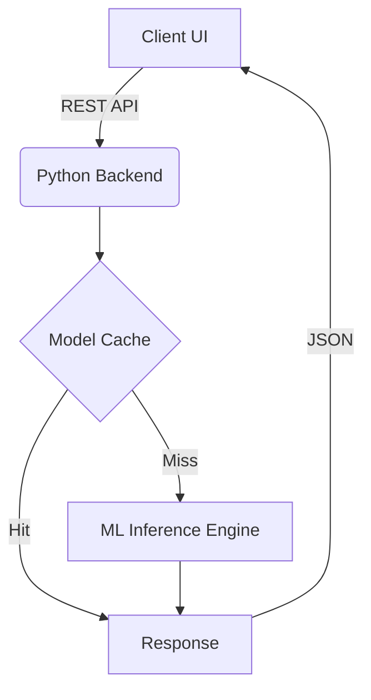

export const metadata = {
  title: "NexusAI",
  slug: "nexusai",
  description:
    "An AI-powered generative design tool that helps creators brainstorm visual concepts effortlessly with machine learning.",
  stack: ["react", "python", "docker"],
  year: "2024",
  category: "Machine Learning",
  accent: "#ec4899",
  thumbnail: "/projects/porto/thumbnail.png",
};

## The Future of Creation

NexusAI explores the intersection of machine learning and human creativity. Built using React and powered by a robust Python backend deployed on Docker, this tool generates high-fidelity visual concepts from simple text prompts.

### Technical Highlights
- Real-time model inference using custom APIs.
- Seamless containerized deployment ensuring scalability.
- A beautiful, responsive UI crafted for creative professionals.

### Task List
- [x] Integrate `remark-gfm`
- [x] Add Mermaid JS support
- [ ] Deploy to production

### Feature Comparison

| Feature | NexusAI | Traditional Tools |
| :--- | :---: | :---: |
| **Generation Speed** | ~2s | N/A |
| **Collaboration** | Real-time | Manual |
| **Cost** | Low | High |

### Architecture Flow

